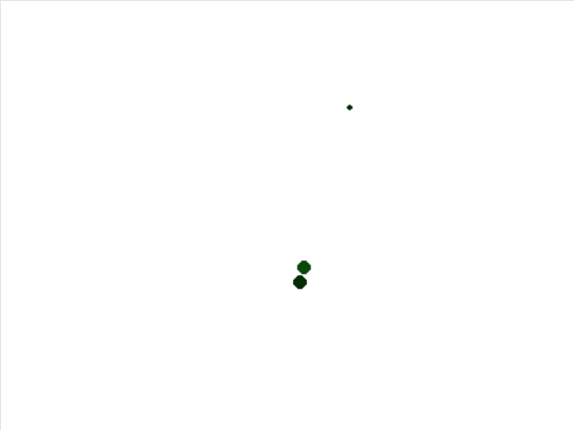
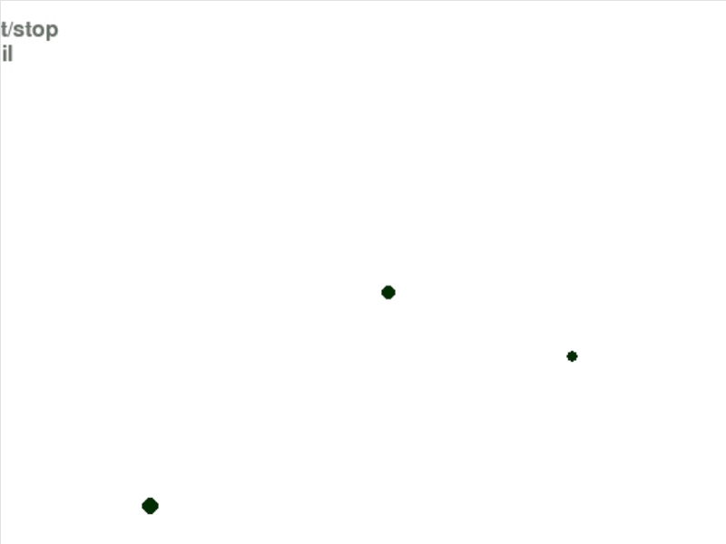
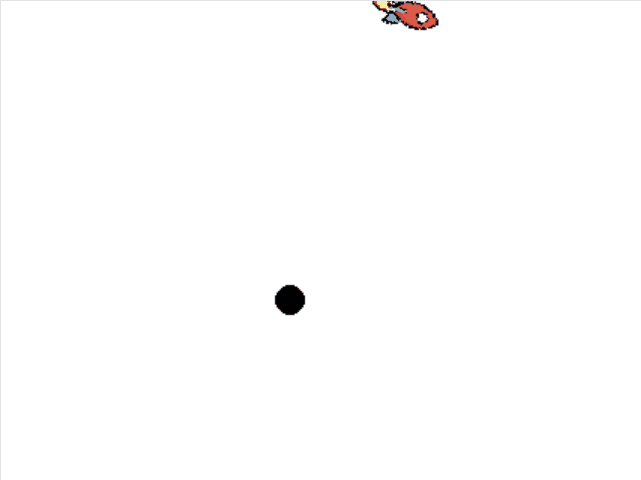
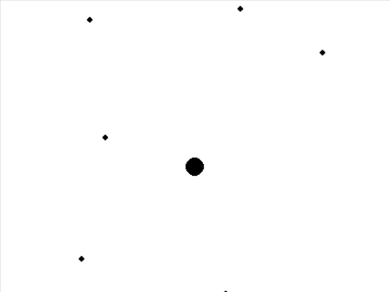
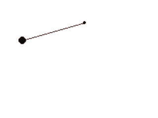
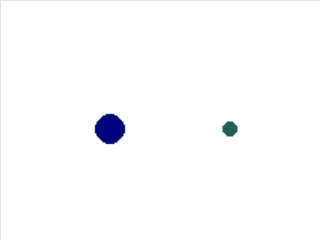
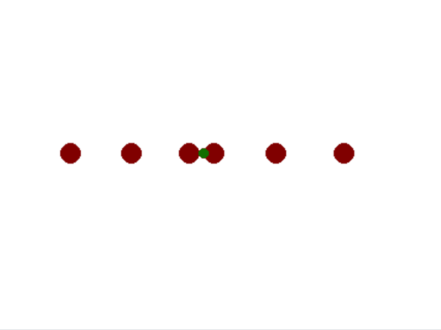
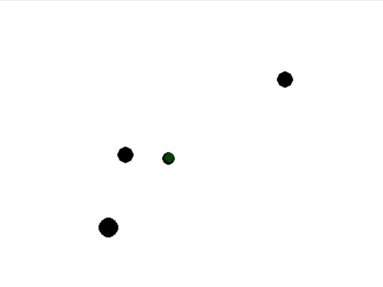
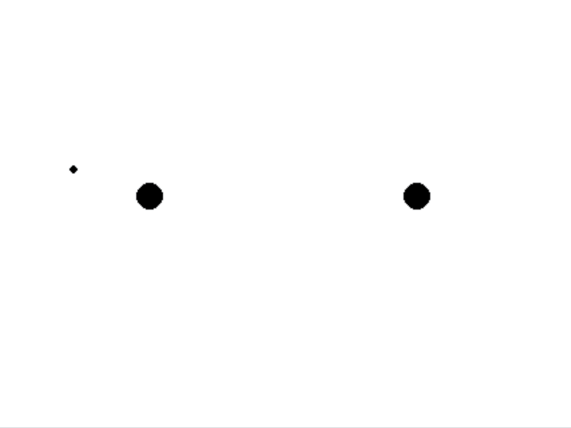

# TinyPysics

A 2D physics simulation engine for educational purposes, demonstrating orbital mechanics, collisions, springs, and more.

TinyPysics is designed for teaching physics concepts through interactive simulations. It can be used in high school and undergraduate physics classes, or for building simple physics-based games.

This project was originally created in 2013 as a way to visualize examples from my first-year university physics classes and has been modernized for Python 3 in 2025.

## Installation

```bash
# Clone the repository
git clone https://github.com/yourusername/tiny_pysics.git
cd tiny_pysics

# Install dependencies
pip install -r requirements.txt
```

### Requirements

- Python 3.10+
- NumPy >= 1.21.0
- Pygame >= 2.1.0

## Quick Start

```python
from tiny_pysics import PhysObject, System, GravitationalForce

# Create two bodies
sun = PhysObject(400, 300, mass=100000)
planet = PhysObject(500, 300, mass=100)

# Give the planet orbital velocity
planet.vy = 20

# Add gravitational attraction
gravity = GravitationalForce(planet, sun)
planet.add_force(gravity, dynamic=True)

# Create system and simulate
system = System()
system.add_object(sun)
system.add_object(planet)

# Main loop
for _ in range(1000):
    system.update()
    print(f"Planet: ({planet.x:.1f}, {planet.y:.1f})")
```

## Examples

All examples are in the `examples/` directory. Run them with:

```bash
cd examples
python orbital_mechanics_interactive.py
```

### Controls (Common to most examples)

| Key | Action |
|-----|--------|
| SPACE | Start/stop simulation |
| T | Toggle motion trail |
| UP/DOWN | Apply thrust (spacecraft examples) |
| LEFT/RIGHT | Rotate (spacecraft examples) |

### Example Descriptions

| Example | Physics Concepts | Description | Animation |
|---------|------------------|-------------|-----------|
| **orbital_mechanics_interactive.py** | Kepler's laws, two-body problem, momentum | Two bodies in mutual orbit with interactive thrust control. Demonstrates elliptical orbits and spacecraft maneuvering. ||
| **three_body_problem.py** | Chaotic dynamics, N-body gravitational | Three gravitating bodies showing chaotic, unpredictable trajectories. Great for discussing sensitivity to initial conditions. ||
| **spacecraft_dynamics.py** | Rotational dynamics, thrust vectoring | Controllable spacecraft orbiting a planet. Shows how orientation affects thrust direction. ||
| **solar_system.py** | Planetary motion, orbital mechanics | 9 bodies orbiting a central mass. Demonstrates stable orbital configurations and Kepler's third law. ||
| **spring_pendulum.py** | Hooke's law, harmonic motion, damping | Mass on spring with gravity and friction. Spring color shows extension. Perfect for teaching simple harmonic motion. ||
| **coupled_oscillators.py** | Coupled oscillations, normal modes | Two masses connected by a spring. Center of mass stays fixed while masses oscillate. ||
| **elastic_collision.py** | Momentum conservation, elastic collisions | Two objects colliding elastically. Shows momentum and energy conservation. ||
| **collision_cascade.py** | Chain reactions, energy dissipation | Fast object hits row of stationary objects. Demonstrates momentum transfer and friction. ||
| **four_body_collisions.py** | N-body gravity with collisions | Four gravitating bodies that can collide. Shows gravitational clustering. ||
| **binary_star_system.py** | Dual gravity, Lagrange points | Small body orbiting two massive stars. Creates complex trajectories. ||
| **nbody_benchmark.py** | N-body simulation, O(n²) complexity | 60 randomly placed gravitating bodies. Performance benchmark for the engine. ||
| **nbody_threaded.py** | Parallel computation | Same as nbody_benchmark but with multi-threading. Compare performance. ||

## API Overview

### Core Classes

#### Vector
2D vector with NumPy backend:
```python
from tiny_pysics import Vector

v = Vector(3, 4)
print(v.magnitude())  # 5.0
print(v.normalized())  # (0.6, 0.8)
```

#### Force
Force vector with physics properties:
```python
from tiny_pysics import Force

thrust = Force(100, 0)  # 100N in x direction
thrust.reset()  # Set to zero
```

#### PhysObject
Physical body with position, velocity, and mass:
```python
from tiny_pysics import PhysObject

ball = PhysObject(x=100, y=200, mass=10)
ball.set_velocity(5, 0)
ball.tick()  # Advance one timestep
```

#### System
Container for multiple physics objects:
```python
from tiny_pysics import System

system = System()
system.add_object(ball)
system.setup_gravity()  # Enable mutual gravity
system.update()  # Update all objects
```

### Force Types

```python
from tiny_pysics.forces import GravitationalForce, ElasticForce, Friction

# Gravitational attraction
grav = GravitationalForce(planet, sun)

# Spring force
spring = ElasticForce(ball, anchor, rest_length=50, k=10)

# Velocity-dependent friction
friction = Friction(ball, k=0.1, power=1)
```

## Project Structure

```
tiny_pysics/
├── tiny_pysics/              # Main package
│   ├── __init__.py      # Public API
│   ├── core.py          # Vector, Force classes
│   ├── physics.py       # PhysObject, System
│   ├── forces.py        # Specialized forces
│   ├── utils.py         # Utility functions
│   └── game.py          # Game extensions
├── examples/            # Example simulations
├── extras/              # Experimental server
├── tests/               # Unit tests
├── requirements.txt
└── README.md
```

## Running Tests

```bash
# Install pytest
pip install pytest

# Run all tests
pytest tests/

# Run with verbose output
pytest tests/ -v
```

## Physics Implementation

### Integration Methods

TinyPysics supports two integration methods:

1. **Verlet Integration** (default): More stable for oscillatory systems like orbits and springs
   ```python
   obj.tick()  # Uses Verlet
   ```

2. **Euler Integration**: Simpler but less stable
   ```python
   obj.tick_euler()  # Uses Euler
   ```

### Gravitational Constant

The gravitational constant G is scaled for simulation purposes (G = 6.67) rather than using SI units. Adjust masses accordingly for your simulations.

## License

See LICENSE file.

## Contributing

Contributions are welcome! Please feel free to submit issues and pull requests.
